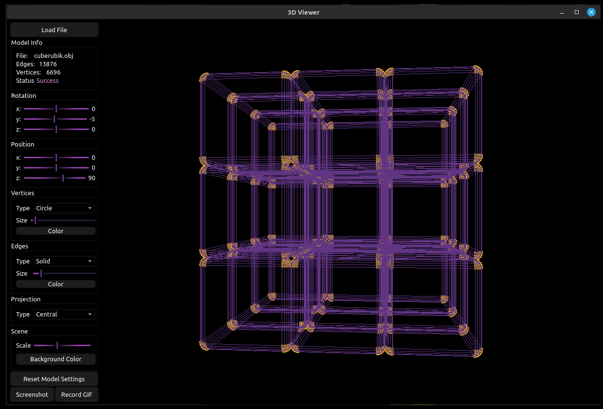

# 3DViewer v1.0

Implementation of 3DViewer v1.0.

In this project you will implement a program to view 3D wireframe models (3D Viewer) in the C/C++ programming language. The models themselves must be loaded from .obj files and be viewable on the screen with the ability to rotate, scale and translate.

A wireframe model is a model of an object in 3D graphics, which is a set of vertices and edges that defines the shape of the displayed polyhedral object in three-dimensional space.



### .Obj file format for representing the definition of 3D objects

.Obj file is a geometry definition file format first developed by Wavefront Technologies. The file format is open and accepted by many 3D graphics application vendors.

The .obj file format is a simple data format that represents only three-dimensional geometry, specifically the position of each vertex, the UV of each texture coordinate vertex, vertex normals and the faces that define each polygon as a list of vertices and texture vertices. Obj coordinates have no units, but Obj files can contain scale information in a readable comment line.

The example of .obj file format:

```
  # List of geometric vertices, with (x, y, z [,w]) coordinates, w is optional and defaults to 1.0.
  v 0.123 0.234 0.345 1.0
  v ...
  ...
  # Texture coordinates (u, [,v ,w]), w is optional and default to 0.
  vt 0.500 -1.352 [0.234]
  vt ...
  ...
  # Normals (x,y,z)
  vn 0.707 0.000 0.707
  vn ...
  ...
  # Parameter space vertices (u [,v] [,w])
  vn 0.707 0.000 0.707
  vn ...
  ...
  # Polygonal face element
  f v1 v2 v3
  f ...
  ...
  # Group
  g Group1
  ...
  # Object
  o Object1
```

In this project, you will only need to implement vertices and surfaces list support. Everything else is optional.

### Affine transformations

This section will describe basic affine transformations (translation, rotation, scaling) in the plane, using two-dimensional objects (images) as an example. Similarly, affine transformations can also be used for three-dimensional space.

An affine transformation is a mapping in a plane or space onto itself in which parallel lines transforms into parallel lines, intersecting lines into intersecting lines, and skew lines into skew lines.
A transformation in a plane is called affine if it is mutually unambiguous and the image of any line is a line. A transformation (mapping) is called mutually unambiguous (bijective) if it converts different points to different ones, and each point is converted to a point.

In algebraic terms, an affine transformation is a transformation of the form _f(x) = M x + v_, where _M_ is some invertible matrix and _v_ is some value.

Properties of affine transformations:

- A composition of affine transformations is an affine transformation too
- The inverse of an affine transformation is an affine transformation too
- The ratio of areas is conserved.
- The ratio of lengths of line segments is conserved.

#### Translation

Translation matrix in uniform two-dimensional coordinates

```
1 0 a
0 1 b
0 0 1
```

where _a_ and _b_ are the values on _x_ and _y_ by which the source point should be moved. Thus, to move a point, you must multiply the translation matrix by it.

```
x1     1 0 a     x
y1  =  0 1 b    y
1      0 0 1     1
```

where _x_ and _y_ are the original coordinates of the point and _x1_ and _y1_ are the resulting coordinates of the new point after translation.

#### Rotation

Clockwise rotation matrix in uniform two-dimensional coordinates

```
cos(a)  sin(a) 0
-sin(a) cos(a) 0
0       0      1
```

where _a_ is the rotation angle in two-dimensional space. To get the coordinates of the new point it is necessary to multiply the rotation matrix by the original point in the same way as the translation matrix

```
x1     cos(a)  sin(a) 0     x
y1  =  -sin(a) cos(a) 0    y
1      0       0      1     1
```

#### Scaling

Scaling matrix in uniform two-dimensional coordinates

```
a 0 0
0 b 0
0 0 1
```

where _a_ and _b_ are the scaling factors for the OX and OY axes respectively. Obtaining coordinates of a new point is similar to the cases described above.

## Settings

- The program must allow customizing the type of projection (parallel and central)
- The program must allow setting up the type (solid, dashed), color and thickness of the edges, display method (none, circle, square), color and size of the vertices
- The program must allow choosing the background color
- Settings must be saved between program restarts

## Record

- The program must allow saving the captured (rendered) images as bmp and jpeg files.
- The program must allow recording small screencasts by a special button - the current custom affine transformation of the loaded object into gif-animation (640x480, 10fps, 5s)
