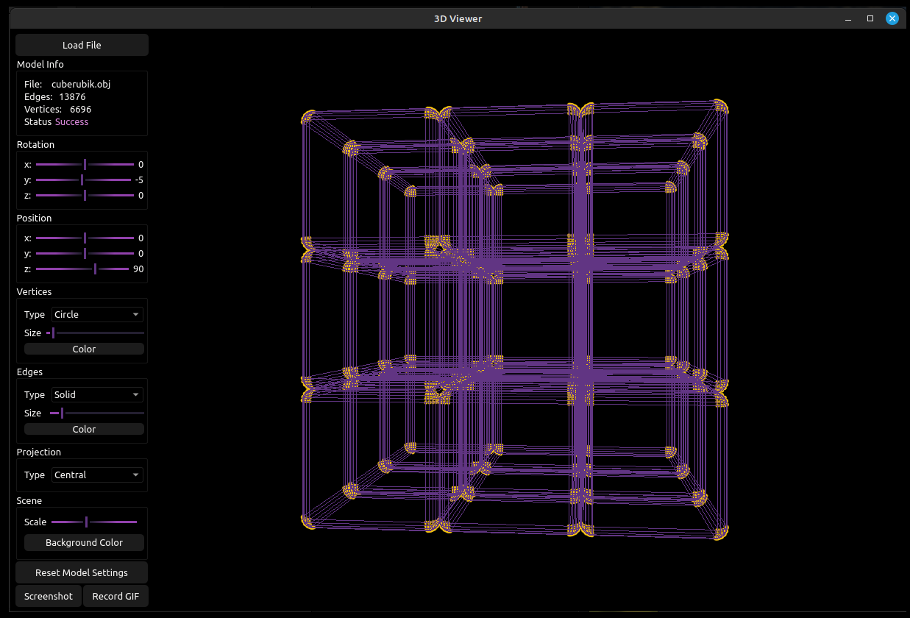

# 3DViewer

Разработать программу 3DViewer

В данном проекте Вам предстоит реализовать на языке программирования С/C++ программу для просмотра 3D моделей в каркасном виде (3D Viewer). Сами модели необходимо загружать из файлов формата .obj и иметь возможность просматривать их на экране с возможностью вращения, масштабирования и перемещения.

Каркасная модель - модель объекта в трёхмерной графике, представляющая собой совокупность вершин и рёбер, которая определяет форму отображаемого многогранного объекта в трехмерном пространстве.



### Формат представления описаний трехмерных объектов .obj

Файлы .obj - это формат файла описания геометрии, впервые разработанный компанией Wavefront Technologies. Формат файла открыт и принят многими поставщиками приложений для 3D-графики.

Формат файла .obj - это простой формат данных, который представляет только трехмерную геометрию, а именно положение каждой вершины, положение UV координат текстуры каждой вершины, нормали вершин и грани, которые определяют каждый многоугольник как список вершин и вершин текстуры. Координаты obj не имеют единиц измерения, но файлы obj могут содержать информацию о масштабе в удобочитаемой строке комментариев.

Пример файла формата .obj:

```
  # Список вершин, с координатами (x, y, z[, w]), w является не обязательным и по умолчанию равен 1.0
  v 0.123 0.234 0.345 1.0
  v ...
  ...
  # Текстурные координаты (u, v[, w]), w является не обязательным и по умолчанию 0
  vt 0.500 -1.352 [0.234]
  vt ...
  ...
  # Нормали (x, y, z)
  vn 0.707 0.000 0.707
  vn ...
  ...
  # Параметры вершин в пространстве (u[, v][, w])
  vp 0.310000 3.210000 2.100000
  vp ...
  ...
  # Определения поверхности (сторон)
  f v1 v2 v3
  f ...
  ...
  # Группа
  g Group1
  ...
  # Объект
  o Object1
```

В данном проекте Вам будет достаточно реализовать поддержку списка вершин и поверхностей. Все остальное - не является обязательным.

### Аффинные преобразования

В данном разделе будут описаны базовые аффинные преобразования (перемещение, поворот, масштабирование) на плоскости на примере двумерных объектов (изображений). Аналогичным образом можно использовать аффинные преобразования и в случае трехмерного пространства.

Аффинное преобразование - отображение плоскости или пространства в себя, при котором параллельные прямые переходят в параллельные прямые, пересекающиеся — в пересекающиеся, скрещивающиеся — в скрещивающиеся. \
Преобразование плоскости называется аффинным если оно взаимно однозначно и образом любой прямой является прямая. Преобразование (отображение) называется взаимно однозначным (биективным), если оно переводит разные точки в разные, и в каждую точку переходит какая-то точка.

С алгебраической точки зрения аффинное преобразование это преобразование вида: _f(x) = M \* x + v_, где _M_ - некая обратимая матрица, а _v_ - какое-то значение.

Свойства аффинных преобразований:

- Композиция аффинных преобразований есть снова аффинное преобразование.
- Преобразование, обратное к аффинному, есть снова аффинное преобразование.
- Отношение площадей сохраняется.
- Отношение длин отрезков на прямой сохраняется.

#### Перемещение

Матрица перемещения в однородных двумерных координатах:

```
1 0 a
0 1 b
0 0 1
```

где _a_ и _b_ - величины по _x_ и _y_, на которые необходимо переместить исходную точку. Таким образом, чтобы переместить точку необходимо умножить матрицу перемещения на нее:

```
x1     1 0 a     x
y1  =  0 1 b  *  y
1      0 0 1     1
```

где _x_ и _y_ - исходные координаты точки, а _x1_ и _y1_ - полученные координаты новой точки после перемещения.

#### Поворот

Матрица поворота по часовой стрелке в однородных двумерных координатах:

```
cos(a)  sin(a) 0
-sin(a) cos(a) 0
0       0      1
```

где _a_ - угол поворота в двумерном пространстве. Для получения координат новой точки необходимо также, как и матрицу перемещения, перемножить матрицу поворота на исходную точку:

```
x1     cos(a)  sin(a) 0     x
y1  =  -sin(a) cos(a) 0  *  y
1      0       0      1     1
```

#### Масштабирование

Матрица масштабирования в однородных двумерных координатах:

```
a 0 0
0 b 0
0 0 1
```

где _a_ и _b_ - коэффициенты масштабирования соответственно по осям OX и OY. Получение координат новой точки происходит аналогично описанным выше случаям.
